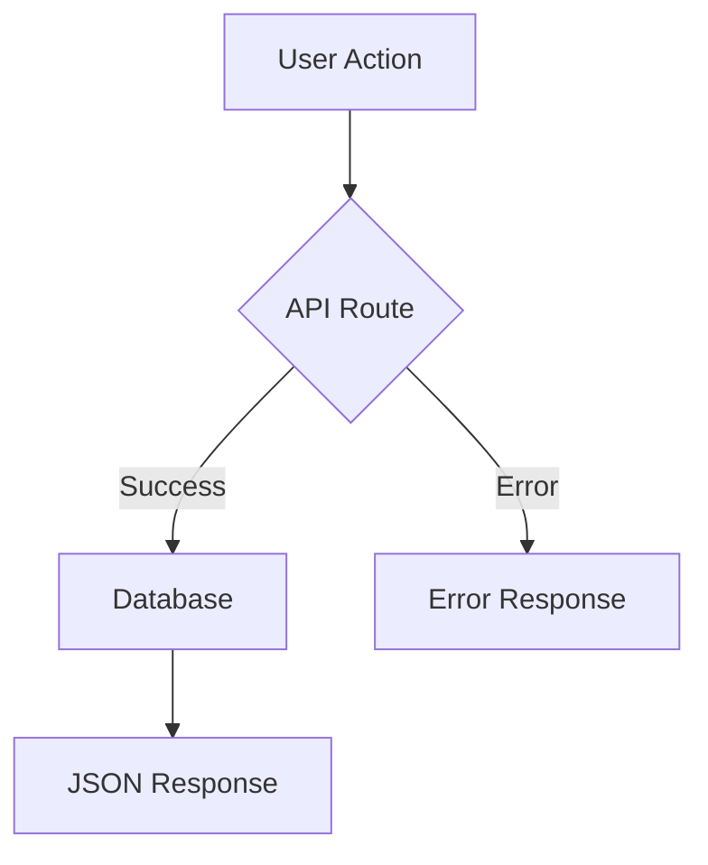

# AGENTS.md

## Build Commands

```bash
bun dev              # Start dev server with Turbopack
bun run build        # Production build
bun start            # Start production server
bun lint             # Run ESLint
bun run grab-server  # Run react-grab visual editor server
```

## Cardinal Rules

### Think Holistically First
Before ANY changes, consider:
- ALL relevant files in the project
- ALL previous file changes and user modifications
- The entire project context and dependencies
- Potential impacts on other parts of the system

This holistic approach is ABSOLUTELY ESSENTIAL for coherent solutions.

### Context First
1. **ALWAYS read files before editing** - Never modify files without reading them first
2. **Check existing patterns** - Search codebase for similar implementations before creating new ones
3. **Batch operations** - Make parallel tool calls when operations are independent
4. **Verify relationships** - Check parent components, global styles, and related utilities

### Don't Stop at First Match
- When searching finds multiple files, examine ALL of them
- When you find a component, check if it's the right variant/version
- Look beyond the obvious - check parent components, related utilities, similar patterns

### Understand the Full System
- Layout issues? Check parents, wrappers, and global styles first
- Adding features? Find existing similar implementations to follow
- Styling? Check theme systems, utility classes, and component variants
- Types? Look for existing schemas, interfaces, and validation patterns
- State changes? Trace where state actually lives and flows
- API work? Understand existing patterns and error handling

## Response Guidelines

### Be Helpful, Not Brief
- Provide thorough explanations when they help understanding
- Explain your reasoning and approach
- Offer alternatives when appropriate
- Use code blocks and formatting for clarity
- After editing code, provide clear summaries of what changed

### Efficient Editing
- Prefer search-replace over full rewrites when appropriate
- Indicate unchanged code with `// ... existing code ...` when helpful
- Split into components - avoid monolithic files
- Add change comments for non-obvious edits

### Code References
When referencing code, include file path and line number:
```
The error occurs in `lib/auth.ts:42` in the verifyToken function.
```

### Discussion Before Implementation
- For complex features, discuss approach before coding
- Ask clarifying questions rather than guessing
- Verify scope: "What will change vs. what stays the same?"
- Discuss approach when unsure, but proceed confidently when clear

## Code Style Guidelines

### Imports
- Use absolute imports with `@/` alias: `import X from '@/lib/x'`
- Group imports: external libs, then internal components/utils
- No default exports for named exports (prefer consistency)
- **Never use `require()`** - always use `import` statements

### TypeScript
- Strict mode enabled in tsconfig.json
- Avoid `any` - use `unknown` or proper types
- Define interfaces for all props, API responses, and payloads
- Use type guards for runtime type checking (e.g., `isValidationError`)

### Naming Conventions
- Components: PascalCase for files and exports
- Variables/functions: camelCase
- Constants: SCREAMING_SNAKE_CASE
- Interfaces: PascalCase with descriptive names (e.g., `MongooseValidationError`)
- Files: prefer kebab-case (e.g., `login-form.tsx`)

### File Organization
- Server components: default (no `'use client'`)
- Client components: `'use client'` at top, hooks in body
- API routes: `app/api/[resource]/route.ts` with named exports (GET, POST, etc.)
- Utilities: `lib/*.ts`
- Components: `components/*.tsx`
- Models: `models/*.ts` (Mongoose schemas)

### Error Handling
- API routes: try/catch with specific error type guards
- Return consistent error format: `{ error: 'message' }` with appropriate status codes
- Log errors with `console.error` before returning 500
- Use type guards for Mongoose errors (`isValidationError`, `isDuplicateError`)
- **Always include `console.error`** when showing toast errors

### React Patterns
- Client components for hooks/events only
- Use `useMemo` for expensive computations
- Use `useCallback` for event handlers passed to children
- Follow component signature: `export function ComponentName({ prop1, prop2 }: Props)`
- **Small, focused components** - split large files, maximize reusability
- **Do NOT fetch inside useEffect** - pass data from RSC or use SWR/TanStack Query

### API Documentation
Document every API endpoint with a comment:
```tsx
// Creates a new todo item.
export async function POST(request: NextRequest) { ... }

// Retrieves all todos for the authenticated user, ordered by creation date.
export async function GET(request: NextRequest) { ... }
```

## Design System Rules

### CRITICAL: Semantic Tokens Only
```tsx
// ❌ NEVER use direct colors
<div className="bg-white text-black" />
<div className="bg-gray-900 text-white" />
<div className="text-white bg-blue-500" />

// ✅ ALWAYS use semantic tokens
<div className="bg-background text-foreground" />
<div className="bg-primary text-primary-foreground" />
<div className="bg-card text-card-foreground" />
```

### Design System is Everything
- **Never write custom colors in components** - use design tokens from `globals.css`
- **Customize components via variants** - not inline overrides
- **Define styles in one place** - `globals.css` and `tailwind.config.ts`
- **3-5 colors maximum** - 1 primary + 2-3 neutrals + 1-2 accents
- **Avoid indigo/blue** as primary unless explicitly requested

### Use HeroUI Built-in Variants
```tsx
// ❌ WRONG - Hacky inline overrides
<Button className="bg-gradient-to-r from-blue-500 to-purple-500 text-white" />

// ✅ CORRECT - Use HeroUI props and design tokens
<Button color="primary" variant="solid" />
<Button color="primary" variant="shadow" />
<Button color="default" variant="bordered" />

// For custom styles, extend via globals.css tokens
<Button className="bg-gradient-primary text-primary-foreground" />
```

### Dark Mode Contrast
- When overriding background, ALWAYS override text color
- Test both light and dark modes
- Never use `text-white` on potentially white backgrounds
- HeroUI handles dark mode automatically via `dark` class on root

### CSS/Tailwind
- Use semantic CSS variables from `app/globals.css` (not hardcoded colors)
- RTL-safe classes: `ms`/`me`, `ps`/`pe`, `start`/`end` (never `ml`/`mr`, etc.)
- Use `cn()` utility from `@/lib/utils` for conditional classes
- **Prefer gap classes**: `gap-4` not `space-x-4` or margin chains
- **Prefer Tailwind scale**: `p-4` not `p-[16px]`
- **Card padding**: Use consistent `p-4` or `p-6`, `gap-4` or `gap-6` for spacing

### Typography
- **Maximum 2 font families** - one for headings, one for body
- Use `font-sans`, `font-serif`, `font-mono` classes
- Line height 1.4-1.6 for body text (`leading-relaxed`)
- Never use decorative fonts for body text
- **Never use fonts smaller than 14px**
- Use `text-balance` or `text-pretty` for titles and important copy

## UI/UX Standards (MANDATORY)

### Interactive Elements
- **Loading states**: Show spinners/skeletons during async operations
- **Error handling**: Clear, actionable error messages
- **Toast notifications**: Use toast for important user feedback
- **Hover effects**: Interactive feedback on ALL clickable elements
- **Animations**: Subtle Framer Motion transitions (hover, focus, page transitions)

### Touch & Accessibility
- **Touch targets**: Minimum 44px for mobile interactive elements
- **Keyboard navigation**: All elements must be keyboard accessible
- **Screen readers**: Use `sr-only` class for screen reader content

### Long Lists
```tsx
// Handle long lists with scroll and custom scrollbar
<div className="max-h-96 overflow-y-auto">
  {items.map(item => <Item key={item.id} />)}
</div>
```

### Responsive Design
- **Mobile-first**: Design for mobile, then enhance for desktop
- **Breakpoints**: Use Tailwind responsive prefixes (`sm:`, `md:`, `lg:`, `xl:`)

## Arabic/Localization

- Arabic-first: default `lang="ar-SA"`, `dir="rtl"`
- Translations: add to both `lib/translations/ar.ts` and `en.ts`
- Use `useLanguage` context for translations

### RTL-Safe Classes
| Use | Avoid |
|-----|-------|
| `ps-4`, `pe-4` | `pl-4`, `pr-4` |
| `ms-4`, `me-4` | `ml-4`, `mr-4` |
| `start-6`, `end-6` | `left-6`, `right-6` |

## Accessibility

- Semantic HTML (`<nav>`, `<main>`, `<article>`, `<section>`, `<header>`)
- `aria-label` on icon-only buttons
- Proper ARIA roles, labels, and descriptions
- Keyboard navigation support
- Respect `prefers-reduced-motion`
- Alt text for all images with relevant keywords

## SEO Requirements

- **Title tags**: Under 60 characters with main keyword
- **Meta description**: Max 160 characters with target keyword
- **Single H1**: One per page matching primary intent
- **Semantic HTML**: Use `<main>`, `<nav>`, `<article>`, `<aside>`
- **Image optimization**: Descriptive alt attributes, lazy loading
- **Clean URLs**: Descriptive, crawlable internal links
- **Mobile-first**: Responsive design with proper viewport meta

## Debugging Workflow

1. **Check console/dev logs first** - before examining code
2. **Check network requests** - for API issues
3. **Search codebase** - find related patterns and dependencies
4. **Analyze before modifying** - understand the issue first
5. **Make minimal fixes** - targeted changes, not rewrites
6. **Verify after changes** - always check logs again after coding

## Using Diagrams

When explaining complex architecture, use Mermaid diagrams:



Common diagram types:
- **Flowcharts**: `graph TD` for decision flows
- **Sequence diagrams**: `sequenceDiagram` for API interactions
- **ER diagrams**: `erDiagram` for database design

## Common Pitfalls to AVOID

| Pitfall | Solution |
|---------|----------|
| Writing without reading | ALWAYS read files before editing |
| Not thinking holistically | Consider ALL relevant files first |
| Hardcoded colors | Use semantic tokens only |
| Monolithic files | Split into small, focused components |
| Sequential tool calls | Batch independent operations |
| Overengineering | Stay within explicit request scope |
| Guessing structure | Search and verify first |
| Inline style overrides | Use HeroUI variants or design tokens |
| Ignoring dark mode | Test both modes, ensure contrast |
| Missing loading states | Always show feedback during async ops |
| Forgetting error handling | Include try/catch and toast notifications |
| Small touch targets | Minimum 44px for mobile |
| Fetching in useEffect | Use RSC, SWR, or TanStack Query |
